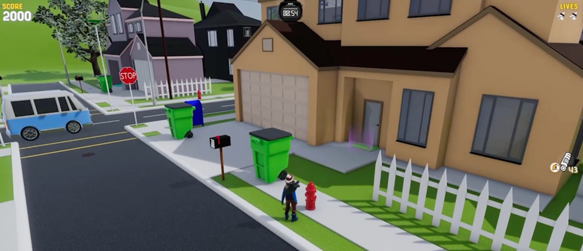
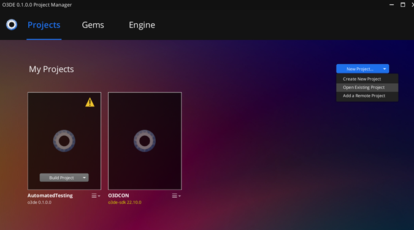
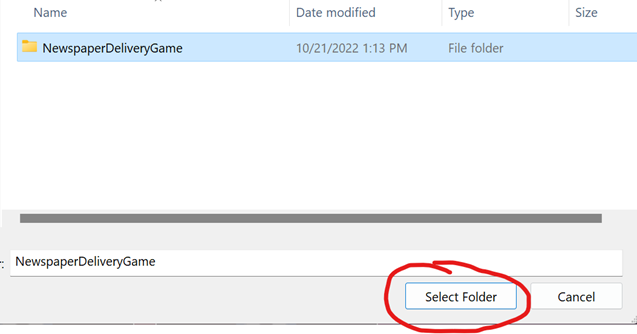
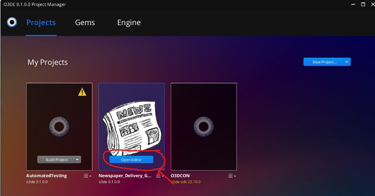
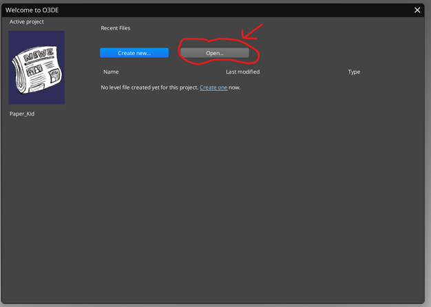
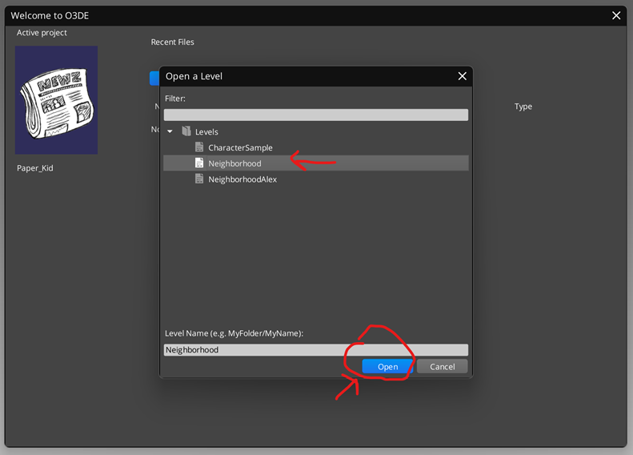
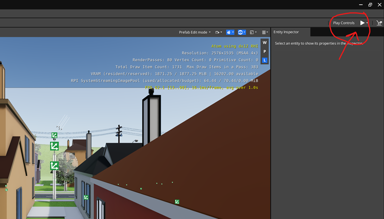
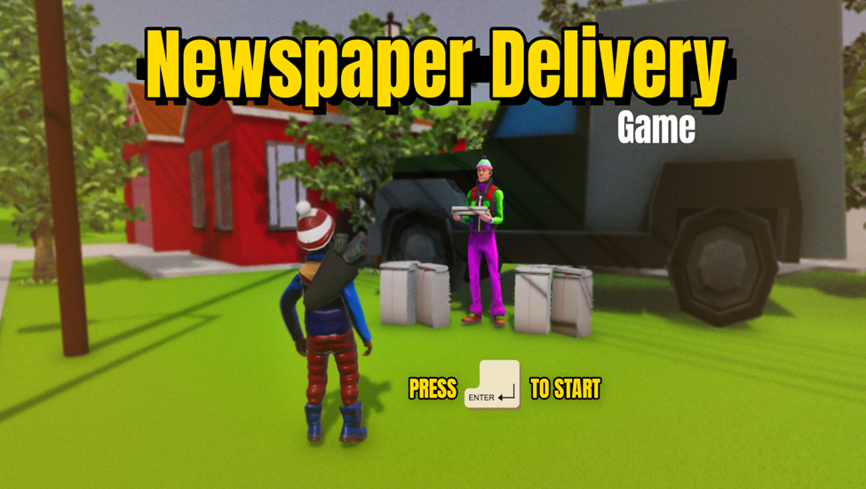
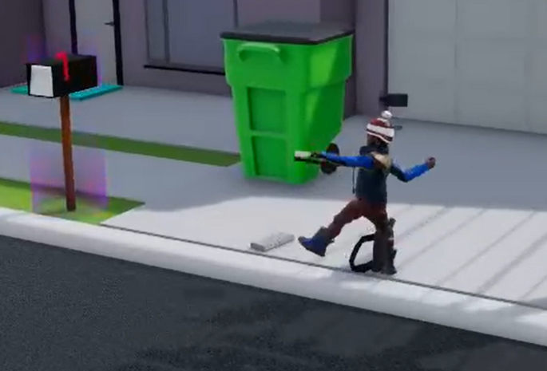

# Newspaper Delivery Game Demo Project

**Project Description:**   
The player takes the role of a newspaper delivery kid who, within a vast fictional 3D world, delivers newspapers to customer’s homes within a set time limit. If all deliveries are made before the timer expires, the player will be allowed to progress on to the next level. Gameplay becomes exceedingly more difficult, by the numerous obstacles in the players path. Obstacles such as electric lawnmowers, cars and trucks.

## Project Screenshots

## The Project Includes

-   **Sprawling suburban environment**, includes homes, lawnmowers, vans and other 3D environment asset models
-   **Newspaper delivery kid**, a ready to use character model, with multiple character animations such as, walk run, strafe and toss.
-   **Script Canvas Visual Scripts,** editable Script Canvas visual scripts for main and in game menu interaction, gameplay and player movement.

## Game Levels

-   **Character Sample**, a test level utilized for testing and analyzing main character animations.
-   **Neighborhood,** the main gameplay level for the Paper Delivery Game.

## Requirements

### Platforms

The project supports the following platforms:

-   **Windows 10 version 1809 (10.0.17763)** or later is required.

## O3DE Installation

1.  Refer to the [O3DE System Requirements](https://www.o3de.org/docs/welcome-guide/requirements/) documentation to make sure that the system/hardware requirements are met.
2.  Please follow the instructions to [set up O3DE from GitHub](https://o3de.org/docs/welcome-guide/setup/setup-from-github/).
3.  **Use the development branch**: git checkout development.

# Building the project

## Build Steps

1.  Clone the Newspaper Delivery game project from the following repo:
    1.  git clone <https://github.com/o3de/NewspaperDeliveryGame>
2.  Within the Project manager locate and click on the **New Project** button. Then from the drop down menu select the **Open Existing Project** option.

    

3.  Once Windows Explorer opens, navigate to and select the **NewspaperDeliveryGame** folder. Once selected click on the **Select Folder** button.

    

4.  This will load the **NewspaperDeliveryGame** project into the **Project Manager**.
5.  In order to build the project, locate and click on the **Build Project** button, located on the **NewspaperDeliveryGame** icon.

    

## Launching the Project

1.  Once the project has been built sucessfully, the **Build Project** button will disappear and an **Open Editor** button should be the only option you can select.
2.  Click on the **Open Editor** button this will open the **NewspaperDeliveryGame** project.

    

## Opening the Gameplay Level

1.  Once the Asset Processor has completed importing and processing a signifgance portion of the assets the O3DE Editor will open.
2.  In the **Welcome to O3DE** splash screen select the **Open** button to open a new level.

    

3.  This will open the **Open a Level** window
4.  Select the Neighborhood level and click the open level to launch the level.

    

5.  Once the level opens click the play button in the upper hand corner to launch the main menu of the game.

    

6.  Once presented with the main menu press the **enter key** on your keyboard to start the game.
7.  

**Controlling the Newspaper Kid Model**

**Navigation**

1.  **The Newspaper Kid model can be moved around the level using the W,A,S,D keyboard keys.**

    ****

**Tossing The Newspaper**

1.  Press the left **Mouse Button** toss the newspaper around the level.

    ****

**License**

For terms please see the LICENSE\*.TXT files at the root of this repository.

For the sake of clarification licensing information can be also be found below.

| OPEN 3D ENGINE LICENSING |
|--------------------------|
|                          |

| The default license for Open 3D Engine is the Apache License, Version 2.0  |
|----------------------------------------------------------------------------|
|                                                                            |

| (see LICENSE_APACHE2.TXT); you may elect at your option to use the Open 3D  |
|-----------------------------------------------------------------------------|
|                                                                             |

| Engine under the MIT License (see LICENSE_MIT.TXT). Contributions must be  |
|----------------------------------------------------------------------------|
|                                                                            |

| made under both licenses. |
|---------------------------|
|                           |

|   |
|---|
|   |

| THIRD PARTY COMPONENTS |
|------------------------|
|                        |

| Open 3D Engine requires the use of (and in some cases makes available to you)  |
|--------------------------------------------------------------------------------|
|                                                                                |

| software and assets that have been developed by third parties and are subject  |
|--------------------------------------------------------------------------------|
|                                                                                |

| to separate license terms (such as code licensed under other open source  |
|---------------------------------------------------------------------------|
|                                                                           |

| licenses). It is your responsibility to comply with the applicable licenses.  |
|-------------------------------------------------------------------------------|
|                                                                               |

| Information on third party materials, and the applicable license terms, are  |
|------------------------------------------------------------------------------|
|                                                                              |

| referenced in or included with the materials, such as in separate LICENSE.txt  |
|--------------------------------------------------------------------------------|
|                                                                                |

| files accompanying the materials. |
|-----------------------------------|
|                                   |

|   |
|---|
|   |

| Please note that certain materials are subject to "copyleft" licenses, which  |
|-------------------------------------------------------------------------------|
|                                                                               |

| require distribution of source code, including: |
|-------------------------------------------------|
|                                                 |

|   |
|---|
|   |

| - Qt Toolkit https://github.com/qtproject/, which is subject to the GNU  |
|--------------------------------------------------------------------------|
|                                                                          |

| Lesser General Public License version 3 (with certain exceptions). A copy of  |
|-------------------------------------------------------------------------------|
|                                                                               |

| the source code for Qt Toolkit may be found at  |
|-------------------------------------------------|
|                                                 |

| https://s3-us-west-2.amazonaws.com/ly-legal/LicenseConformance/Qt/Src.zip |
|---------------------------------------------------------------------------|
|                                                                           |

|   |
|---|
|   |

| - The AWS Python SDK uses Chardet https://chardet.github.io/, which is  |
|-------------------------------------------------------------------------|
|                                                                         |

| subject to the GNU Lesser General Public License version 2.1. A copy of the  |
|------------------------------------------------------------------------------|
|                                                                              |

source code may be found at https://github.com/chardet/chardet.